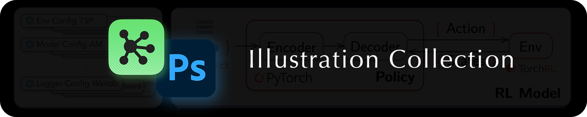

Illustration Collection is a repository to collect the source files of various illustrations in my previous publications. Visit the website at [cbhua.github.io/illustration-collection](https://cbhua.github.io/illustration-collection/) to explore further.

### 💡 Introduction

I have a passion for creating visually appealing illustrations in publications. During my time writing papers, I often dedicated significant effort to craft various illustrations. In this repository, I've compiled some of my previous illustration source files created by [OmniGraffle](https://www.omnigroup.com) or [Adobe Photoshop](https://www.adobe.com). I hope these templates inspire you and provide techniques to craft beautiful illustrations.

### ⚙️ Softwares

Many of the illustrations were crafted using OmniGraffle, my preferred tool for creating publication illustrations. In addition to this, some were produced using Adobe Photoshop. Note that several illustrations incorporate LaTeX equations. Therefore, it's advisable to have LaTeX installed on your Mac. I also highly recommend the [LaTeXiT tool](https://www.chachatelier.fr/latexit/), which is natively supported by macOS. This tool allows for the convenient creation of elegant mathematical equations within illustrations.

### 🔦 How to use

You can easily go to the website: [cbhua.github.io/illustration-collection](https://cbhua.github.io/illustration-collection/) and see those illustrations:

If you want to download the source file of one illustration, you can click on the image. It will lead you to the source file. 

Then you can use the OmniGraffle to open the `.graffle` files and play with it. 

### 🖼 Illustration Example

**RL4CO**

**GraphSplineNets**

**Graph Out-of-domain**

**RL4Phy**

**Water Research**

**Anomaly Detection**

**Hidden Interpolation**

### 📬 Contact

If you have any question or find any bug, feel free to raise an issue. If you have ideas to contribute to this repo, welcome to pull request or contact cbhua@kaist.ac.kr. Thanks for interested to our work!
